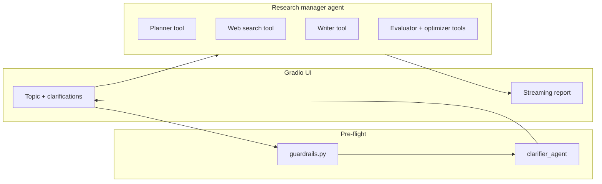

# Architecture

| Layer | Role |
|--------|------|
| `deep_research.py` | Gradio UI, PDF/email helpers, loads `.env` from this folder or parent `2_openai/.env` |
| `guardrails.py` | Length, PII patterns, optional GPT intent check |
| `research_manager.py` | Clarifying questions; streams manager agent with tracing |
| `manager_agent.py` | Plan → search → write → evaluate → optimize via tools |
| `*_agent.py` | Planner, web search, writer, evaluator/optimizer, clarifier, email |

For deployment, **`app.py`** is the Hugging Face Space entrypoint (`gradio run app.py`). For local demos, **`python deep_research.py`** uses `share=True` for a temporary public link.
