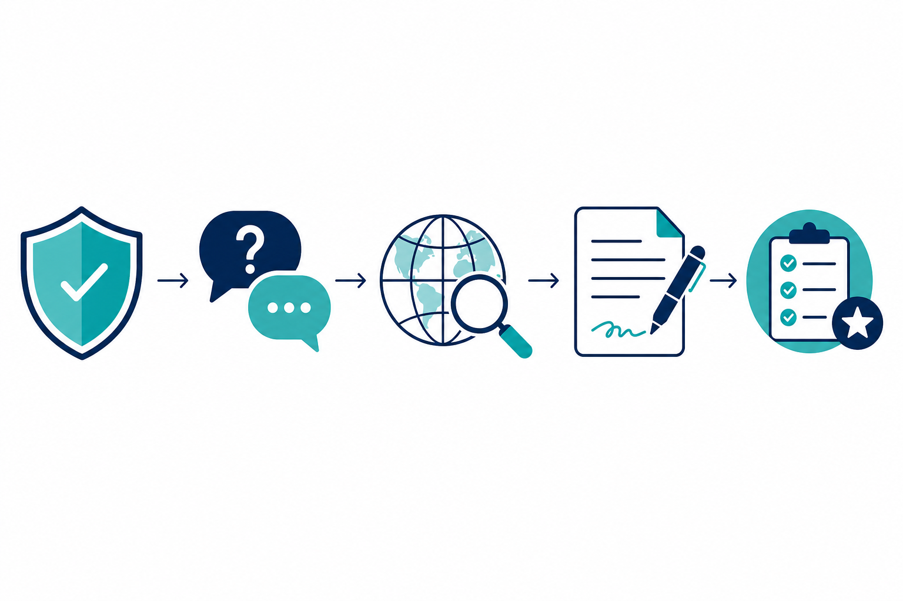

<p align="center">
  
</p>

<h1 align="center">Deep Research</h1>

<p align="center">
  <strong>OpenAI Agents · Web search · Gradio UI · Citations · Guardrails</strong>
</p>

<p align="center">
  <a href="https://github.com/siva-sankari-sivakaminathan/deep_research_openai_agentic_ai"></a>
  <a href="LICENSE"></a>
  
  
</p>

<p align="center">
  <a href="https://github.com/siva-sankari-sivakaminathan/deep_research_openai_agentic_ai"><strong>Source code</strong></a>
  ·
  <a href="https://huggingface.co/spaces/YOUR_USERNAME/YOUR_SPACE"><strong>Live demo</strong></a>
  <sub>(add your Hugging Face Space URL here when deployed)</sub>
  ·
  <a href="ARCHITECTURE.md">Architecture</a>
  ·
  <a href="https://github.com/openai/openai-agents-python">OpenAI Agents SDK</a>
</p>

---

## Overview

**Deep Research** is a small, production-minded demo of an agentic research assistant. You describe a topic; the system optionally asks **three clarifying questions**, runs **guardrails** (length, sensitive patterns, research-intent check), then an autonomous **manager agent** plans web searches, gathers summaries, writes a **long markdown report with numbered citations** (`[1]`, `[2]`, … and a **Sources** section), and runs an **evaluator → optimizer** loop when quality needs improvement. Optional **PDF export** and **SendGrid email** round out the workflow.

<p align="center">
  
</p>

Use this repo **as-is for learning**, as a **template for your own Space**, or fork it for experiments. **Do not put API keys in the repo** — use environment variables only ([`.env.example`](.env.example)).

---

## Highlights

| Area | What it does |
|------|----------------|
| **Safety & focus** | Length limits, PII-style checks, optional GPT-based “is this research?” gate |
| **Clarifying questions** | Three targeted questions before the heavy run |
| **Research loop** | Plan searches → run web search per term → synthesize report |
| **Quality** | Evaluator scores the report; optimizer refines when needed |
| **Citations** | Numbered references tied to search summaries |
| **UX** | Streaming updates in **Gradio**; optional share link locally |

---

## Screenshots

_Add your own screenshots here after deployment — for example a grab of your Hugging Face Space or local Gradio UI._

<!-- Example (uncomment after you add files under assets/screenshots/):

<p align="center">
  
</p>

-->

---

## Quick start (local)

```bash
pip install -r requirements.txt
cp .env.example .env   # Windows: copy .env.example .env
# Edit .env — set OPENAI_API_KEY at minimum

python deep_research.py
```

`deep_research.py` enables **Gradio `share=True`**, so you also get a temporary **gradio.live** link for demos.

**Environment:** Loads `.env` from this folder first; if this project still lives inside a parent layout, it can fall back to `../.env` for convenience.

---

## Repository

Public project: **[github.com/siva-sankari-sivakaminathan/deep_research_openai_agentic_ai](https://github.com/siva-sankari-sivakaminathan/deep_research_openai_agentic_ai)**

Clone:

```bash
git clone https://github.com/siva-sankari-sivakaminathan/deep_research_openai_agentic_ai.git
cd deep_research_openai_agentic_ai
```

Push updates from your machine (after [`git remote`](https://docs.github.com/en/get-started/getting-started-with-git/managing-remote-repositories) points at this repo):

```bash
git add -A
git commit -m "Describe your change"
git push origin main
```

On GitHub: **Settings → Secrets and variables → Actions** → add optional **`OPENAI_API_KEY`** if you want full guardrail intent tests in CI (see [`.github/workflows/ci.yml`](.github/workflows/ci.yml)).

---

## Tests

```bash
pip install -r requirements-dev.txt
python -m pytest tests/ -v
```

Intent-related tests are skipped unless **`OPENAI_API_KEY`** is set.

---

## Deploy (Hugging Face Spaces)

Typical flow: create a **Gradio** Space, copy these files to the Space repo root (`app.py`, `deep_research.py`, agents, `requirements.txt`, etc.), then push. Configure **`OPENAI_API_KEY`** (and optional SendGrid vars) in Space secrets.

Details: [Hugging Face Spaces — Gradio](https://huggingface.co/docs/hub/spaces-sdks-gradio).

---

## Security

Never commit **`.env`** or live keys. Reports may contain fetched web content — operate under your own **OpenAI usage policies** and **SendGrid** sender rules.

---

## License

[MIT](LICENSE)
